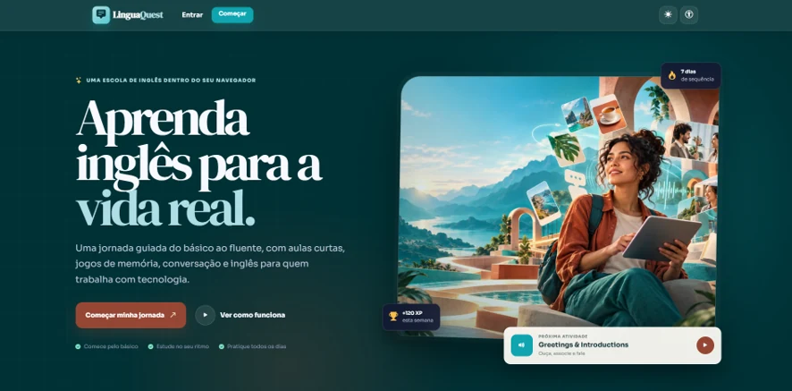
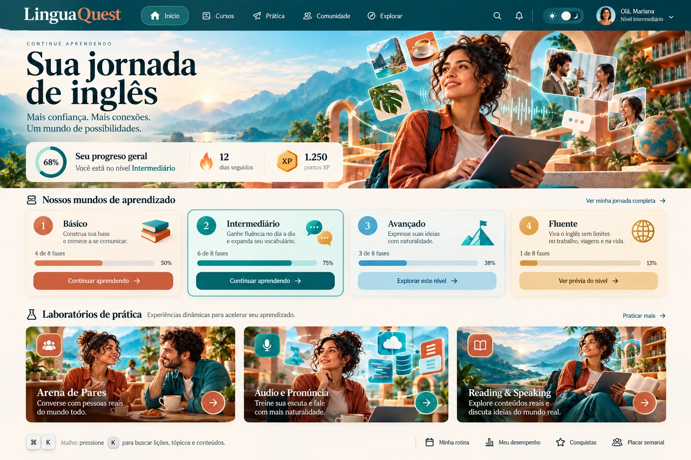
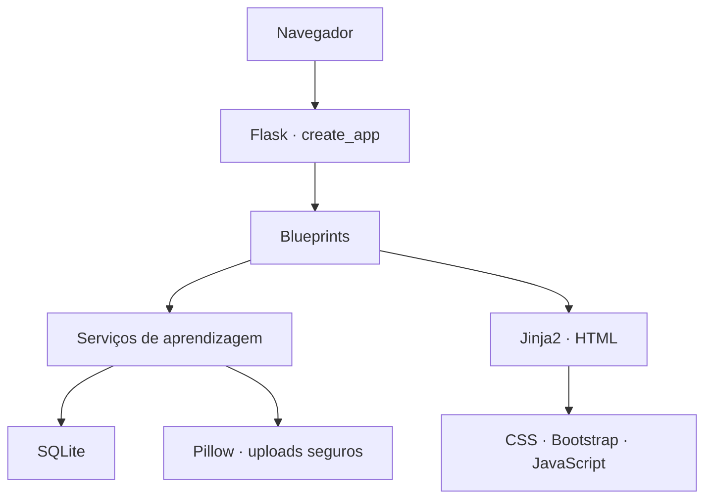

<div align="center">

# LinguaQuest

### Learning through memorization

Plataforma web bilíngue para aprender inglês do nível básico à comunicação profissional, combinando aulas progressivas, áudio, jogos, leitura, repetição espaçada e inglês para tecnologia.


</div>

---

## Visão do projeto



O **LinguaQuest** é um projeto educacional completo desenvolvido com Python e Flask. Sua finalidade é transformar o estudo de inglês em uma jornada clara, visual e progressiva, com explicações em inglês e português, prática ativa e registro individual de progresso.

O sistema foi pensado para estudantes brasileiros que desejam:

- começar pelo vocabulário e pela gramática essencial;
- memorizar palavras por associação entre inglês e português;
- melhorar a escuta com áudios em velocidade normal e lenta;
- praticar leitura, repetição e fala;
- compreender números e informar telefone em inglês;
- evoluir por fases do básico ao fluente;
- aprender inglês usado por profissionais de Python e tecnologia;
- estudar em uma interface acessível com mouse, teclado, toque ou leitor de tela.

## Painel de aprendizagem



O painel organiza o conteúdo em **quatro mundos de aprendizagem**. Cada card leva a uma página própria, na qual o estudante encontra as fases e atividades relacionadas ao nível escolhido.

A interface utiliza:

- hero fotográfico com tipografia editorial;
- cores teal, ciano, terracota, dourado e off-white;
- CSS Grid para mundos, fases, laboratórios e aulas;
- glassmorphism em painéis de progresso;
- microinterações e profundidade visual;
- parallax com `background-attachment: fixed` no desktop;
- reorganização responsiva em duas ou uma coluna;
- tema claro inicial e dark mode opcional;
- versão local do Bootstrap e dos Bootstrap Icons;
- arquivos estáticos versionados para evitar cache de CSS antigo.

---

## Números do projeto

| Recurso | Quantidade |
|---|---:|
| Mundos de aprendizagem | 4 |
| Lições da trilha principal | 16 |
| Exercícios da trilha principal | 80 |
| Unidades das aulas presenciais | 9 |
| Desafios das aulas presenciais | 54 |
| Textos de leitura e fala | 15 |
| Temas da Arena de Pares | 8 |
| Associações inglês–português | 92 |
| Trechos do laboratório de áudio | 64 |
| Arquivos MP3, normal e lento | 128 |
| Números para treinamento | 0 a 50 |
| Testes automatizados | 8 |

---

## Principais finalidades

### 1. Ensino progressivo

O estudante não recebe todo o conteúdo de forma desorganizada. A trilha estabelece uma sequência: aprender, praticar, receber feedback, concluir a fase e liberar a próxima.

### 2. Memorização ativa

O projeto aplica atividades de reconhecimento, associação, escuta e escrita. Em vez de apenas ler uma tradução, o aluno precisa recuperar a resposta da memória.

### 3. Repetição espaçada

Respostas entram em um sistema de revisão inspirado no método Leitner. Acertos aumentam gradualmente o intervalo de revisão; erros retornam o conteúdo para a primeira etapa.

### 4. Aprendizagem multimodal

O mesmo conteúdo pode aparecer como texto, tradução, áudio, associação, múltipla escolha, escrita e fala. Isso cria mais caminhos de recuperação da memória.

### 5. Inglês para tecnologia

Os níveis avançados incluem vocabulário de Python, Git, APIs, banco de dados, reuniões, documentação, análise de dados, segurança, entrevistas e apresentações técnicas.

### 6. Continuidade das aulas presenciais

Materiais estudados presencialmente foram transformados em unidades bilíngues com objetivos, vocabulário, frases, perguntas e jogos. Assim, o aluno pode revisar em casa exatamente os temas trabalhados em aula.

---

## Currículo: quatro mundos e dezesseis fases

### Mundo 1 — Básico: Primeiros passos

| Fase | Aula | Objetivo |
|---:|---|---|
| 1 | Verbo *to be* | Usar `I am`, `you are`, `he is` e outras formas essenciais |
| 2 | Cumprimentos | Dizer olá, bom dia, boa tarde, boa noite e despedidas |
| 3 | Números 0–50 | Reconhecer, escrever, ouvir e falar números |
| 4 | Telefone | Perguntar e informar número de telefone usando `zero` e `oh` |

### Mundo 2 — Intermediário: Vida em movimento

| Fase | Aula | Objetivo |
|---:|---|---|
| 1 | Frutas e alimentos | Ampliar vocabulário de comidas e bebidas |
| 2 | Animais e lugares | Identificar animais, locais e situações da cidade |
| 3 | Presente simples | Falar sobre hábitos e rotina |
| 4 | Diálogos cotidianos | Responder naturalmente em conversas reais |

### Mundo 3 — Avançado: Inglês em ação

| Fase | Aula | Objetivo |
|---:|---|---|
| 1 | Passado simples | Relatar acontecimentos anteriores |
| 2 | Tempos e conectores | Construir frases mais completas e naturais |
| 3 | Inglês para Python | Compreender código, erros e documentação |
| 4 | Git e trabalho em equipe | Falar sobre commits, revisões e colaboração |

### Mundo 4 — Fluente: Comunicação sem fronteiras

| Fase | Aula | Objetivo |
|---:|---|---|
| 1 | Arquitetura e APIs | Explicar decisões e integrações técnicas |
| 2 | Entrevista técnica | Apresentar experiência e resolver perguntas profissionais |
| 3 | Reuniões e negociação | Concordar, discordar, esclarecer e propor soluções |
| 4 | Projeto final | Apresentar uma aplicação em inglês |

Cada lição contém cinco modelos de exercício:

1. tradução com múltipla escolha;
2. associação de pares;
3. compreensão auditiva;
4. desafio contextual de gramática ou vocabulário;
5. tradução escrita com diferentes respostas aceitas.

---

## Arena de Pares

A Arena de Pares apresenta palavras em duas colunas: **English** e **Português**. O estudante escolhe uma palavra inglesa e encontra sua tradução correspondente.

Temas disponíveis:

1. Greetings — cumprimentos;
2. Numbers — números;
3. Colors — cores;
4. Body parts — partes do corpo;
5. Food & drinks — comidas e bebidas;
6. Animals & fruits — animais e frutas;
7. Places & directions — lugares e direções;
8. Python & technology — Python e tecnologia.

O jogo oferece:

- 92 associações bilíngues;
- pontuação imediata;
- barra de progresso;
- melhor resultado salvo no SQLite;
- quantidade de tentativas;
- recompensa única de 20 XP por tema concluído;
- navegação com mouse, toque, `Tab`, `Shift + Tab`, `Enter` e `Espaço`;
- avisos de seleção, erro e acerto para leitores de tela.

---

## Laboratório de áudio

O laboratório **Família, cidade e cumprimentos** foi criado a partir do material HTML fornecido para o projeto.

Conteúdo:

- 64 trechos em inglês com tradução em português;
- 128 arquivos MP3;
- velocidade normal e lenta;
- pesquisa por palavra ou tradução;
- filtros por parte da aula;
- marcação dos trechos já ouvidos;
- progresso salvo no navegador e no SQLite;
- 30 XP concedidos uma única vez após 48 trechos ouvidos.

Grupos da aula:

- palavras curtas;
- frases em partes;
- frases completas;
- cumprimentos e gentileza;
- revisão da apresentação.

O importador reproduzível está em `tools/import_family_lesson.py`.

---

## Reading & Speaking Lab

Os níveis avançado e fluente incluem 15 textos progressivos:

1. English Class;
2. My Busy Week;
3. Learning English with Technology;
4. My First Python Project;
5. The Bug That Taught Me;
6. A Productive Remote Work Routine;
7. A New Life Abroad;
8. Healthy Learning Habits;
9. Presenting a Software Project;
10. The Technical Interview;
11. From Data to Decision;
12. Building a Reliable API Integration;
13. Security by Design;
14. A Constructive Code Review;
15. AI and the Future of Automation.

Cada texto oferece:

- versão original em inglês;
- tradução em português;
- vocabulário em contexto;
- reprodução normal e lenta;
- frases separadas para *shadowing*;
- perguntas de compreensão;
- prática oral quando o navegador oferece `SpeechRecognition`;
- acompanhamento de escuta, fala e conclusão.

O LinguaQuest não grava nem armazena o áudio do microfone. A permissão é solicitada somente quando o estudante inicia a prática oral.

---

## Aulas presenciais transformadas em atividades

| Aula | Conteúdo em português |
|---:|---|
| Communication | Comunicação e primeiras interações |
| One Day in My Life | Rotina diária |
| Food: Yum or Yuck? | Alimentos e preferências |
| Eating Out | Pedidos em restaurantes |
| Money | Dinheiro, valores e pagamentos |
| Using Technology | Uso de dispositivos e internet |
| Studying Abroad | Estudo e vida no exterior |
| History | Pessoas, monumentos e eventos históricos |
| Politics and Citizenship | Política e cidadania |

Cada unidade contém objetivo pedagógico, vocabulário bilíngue, frases, perguntas de conversação e seis desafios interativos.

---

## Gamificação e acompanhamento

O progresso não é apenas visual. Ele é persistido no banco de dados.

- XP por respostas e conclusões;
- sequência diária de estudo;
- porcentagem geral da trilha;
- fases bloqueadas e liberadas progressivamente;
- melhor pontuação;
- número de tentativas;
- conclusão das aulas presenciais;
- conclusão dos textos;
- progresso na Arena de Pares;
- progresso no laboratório de áudio;
- revisões programadas.

As recompensas únicas impedem que o estudante acumule XP ilimitado repetindo a mesma conclusão.

---

## Design, responsividade e acessibilidade

O projeto aplica **design inclusivo nativo** desde a estrutura HTML.

### Recursos de acessibilidade

- link “Pular para o conteúdo”;
- marcação HTML semântica;
- descrições e rótulos ARIA;
- regiões `aria-live` para feedback dos jogos;
- foco visível;
- navegação completa por teclado;
- tema claro e escuro;
- alto contraste;
- texto ajustável entre 90% e 130%;
- opção para reduzir animações;
- respeito a `prefers-reduced-motion`;
- estados que não dependem somente de cor;
- áreas de clique grandes e responsivas.

### Comportamento responsivo

| Tela | Organização principal |
|---|---|
| Desktop | quatro mundos, três laboratórios e grades amplas |
| Tablet | duas colunas com navegação recolhível |
| Celular | uma coluna, cards maiores e parallax desativado |

O `background-attachment: fixed` é usado somente quando adequado. Em dispositivos móveis, ele muda para `scroll` para evitar falhas de renderização e perda de desempenho.

---

## Tecnologias utilizadas

| Camada | Tecnologia | Finalidade |
|---|---|---|
| Linguagem | Python 3.11+ | regras de negócio, conteúdo e processamento |
| Framework | Flask 3.1.2 | rotas, sessões, templates e APIs JSON |
| Templates | Jinja2 | componentes HTML e conteúdo dinâmico |
| Banco de dados | SQLite | usuários, cursos, respostas e progresso |
| Front-end | HTML5 e CSS3 | estrutura semântica e identidade visual |
| Layout | CSS Grid e Flexbox | grades responsivas e alinhamentos |
| Componentes | Bootstrap 5.3.8 | navegação, formulários e utilitários |
| Ícones | Bootstrap Icons e Flaticon | controles e ilustrações dos mundos |
| Interatividade | JavaScript | jogos, áudio, acessibilidade e requisições assíncronas |
| Imagens | Pillow 11.3.0 | validação, recorte, redimensionamento e WEBP |
| Segurança de arquivo | `secure_filename` e UUID | nomes seguros e prevenção de colisões |
| Configuração | python-dotenv 1.1.1 | variáveis de ambiente |
| Produção | Gunicorn 23.0.0 | servidor WSGI para Linux |
| Testes | `unittest` | validação funcional da aplicação |

Bootstrap, Bootstrap Icons e suas fontes ficam em `app/static/vendor/`. Assim, a interface principal não depende de uma CDN para ser formatada corretamente.

---

## Arquitetura da aplicação



O projeto utiliza o padrão **Application Factory**. A função `create_app()` cria e configura a aplicação, prepara diretórios, inicializa o banco e registra os blueprints.

### Blueprints

| Blueprint | Responsabilidade |
|---|---|
| `auth` | cadastro, login e logout |
| `main` | landing page, painel e páginas dos mundos |
| `learning` | lições, respostas, revisões, jogos, áudio e leitura |
| `profile` | perfil, avatar, cartões e arquivos enviados |

### Serviços

| Arquivo | Responsabilidade |
|---|---|
| `content.py` | currículo dos quatro mundos e criação dos 80 exercícios |
| `classroom_content.py` | conteúdo das nove aulas presenciais |
| `reading_content.py` | biblioteca com 15 textos avançados |
| `match_content.py` | oito temas e 92 pares bilíngues |
| `learning.py` | correção, progresso, sequência e método Leitner |
| `images.py` | processamento seguro de imagens com Pillow |

---

## Estrutura de pastas

```text
linguaquest/
├── app/
│   ├── __init__.py
│   ├── database.py
│   ├── schema.sql
│   ├── security.py
│   ├── blueprints/
│   │   ├── auth/
│   │   ├── learning/
│   │   ├── main/
│   │   └── profile/
│   ├── data/
│   │   └── family_audio.json
│   ├── services/
│   │   ├── classroom_content.py
│   │   ├── content.py
│   │   ├── images.py
│   │   ├── learning.py
│   │   ├── match_content.py
│   │   └── reading_content.py
│   ├── static/
│   │   ├── audio/family/
│   │   ├── css/app.css
│   │   ├── images/brand/
│   │   ├── images/flaticon/
│   │   ├── js/
│   │   └── vendor/
│   └── templates/
│       ├── auth/
│       ├── learning/
│       ├── main/
│       └── profile/
├── docs/
│   ├── screenshots/
│   └── design-reference-v5.png
├── instance/
├── tests/
│   └── test_app.py
├── tools/
│   └── import_family_lesson.py
├── config.py
├── run.py
├── wsgi.py
├── requirements.txt
├── CREDITS.md
└── README.md
```

`instance/` armazena o banco e os uploads locais. Seu conteúdo não deve ser enviado para um repositório público contendo dados reais de usuários.

---

## Banco de dados SQLite

O esquema contém quinze tabelas:

| Tabela | Conteúdo |
|---|---|
| `users` | conta, senha protegida, XP e sequência |
| `lessons` | cadastro das 16 lições |
| `exercises` | exercícios da trilha principal |
| `lesson_progress` | progresso e pontuação por lição |
| `submissions` | respostas enviadas |
| `reviews` | caixas e datas da revisão espaçada |
| `custom_cards` | cartões pessoais do estudante |
| `classroom_units` | unidades das aulas presenciais |
| `classroom_exercises` | exercícios dessas unidades |
| `classroom_progress` | progresso das aulas presenciais |
| `classroom_submissions` | respostas das aulas presenciais |
| `reading_texts` | textos da biblioteca |
| `reading_progress` | escuta, fala e conclusão dos textos |
| `match_arena_progress` | pontuação e tentativas por tema |
| `audio_lab_progress` | quantidade de trechos ouvidos |

Índices específicos aceleram consultas de exercícios, revisões, respostas e progresso.

---

## Rotas principais

| Método | Rota | Finalidade |
|---|---|---|
| `GET` | `/` | landing page ou redirecionamento ao painel |
| `GET/POST` | `/auth/cadastro` | criação de conta |
| `GET/POST` | `/auth/entrar` | autenticação |
| `POST` | `/auth/sair` | encerramento seguro da sessão |
| `GET` | `/painel` | painel geral do estudante |
| `GET` | `/mundo/<nivel>` | fases de cada mundo |
| `GET` | `/aprender/licao/<slug>` | aula da trilha principal |
| `GET` | `/aprender/aula-presencial/<slug>` | unidade das aulas presenciais |
| `GET` | `/aprender/arena-pares` | jogo de associação |
| `GET` | `/aprender/laboratorio-numeros` | números e telefone |
| `GET` | `/aprender/laboratorio-audio/familia-cidade` | aula com 128 áudios |
| `GET` | `/aprender/leituras` | biblioteca de textos |
| `GET` | `/aprender/leitura/<slug>` | leitura individual |
| `GET` | `/aprender/revisao` | revisão espaçada |
| `GET/POST` | `/perfil/` | perfil e cartões pessoais |

As respostas, conclusões e progressos são enviados por rotas `POST` protegidas por CSRF.

---

## Processamento de imagens com Pillow

O serviço `app/services/images.py` executa este pipeline:

1. limita o envio a 5 MB;
2. aceita JPG, JPEG, PNG e WEBP;
3. normaliza o nome com `secure_filename`;
4. acrescenta um UUID para evitar colisões;
5. valida os bytes reais com Pillow;
6. corrige orientação EXIF;
7. converte o modo de cor para RGB;
8. recorta avatares;
9. limita imagens comuns a 1200 × 900;
10. cria miniatura de 320 × 240;
11. exporta WEBP otimizado.

Esse processamento impede que imagens muito grandes quebrem o layout ou deixem a aplicação lenta.

---

## Segurança implementada

- senha armazenada com hash do Werkzeug;
- consultas SQLite parametrizadas;
- token CSRF em formulários e APIs JSON;
- cookie de sessão `HttpOnly` e `SameSite=Lax`;
- limite de tamanho para uploads;
- validação do conteúdo real da imagem;
- nomes de arquivos saneados e aleatórios;
- controle de propriedade ao excluir cartões;
- correção das respostas no servidor;
- recompensa de XP não duplicada;
- `X-Content-Type-Options: nosniff`;
- `X-Frame-Options: SAMEORIGIN`;
- política de permissões para câmera, geolocalização e microfone.

Para produção, use uma `SECRET_KEY` longa e ative cookies seguros em HTTPS.

---

## Instalação no Windows

### Opção 1 — terminal do VS Code

Abra a pasta do projeto no VS Code e execute:

```powershell
py -m venv .venv
.venv\Scripts\Activate.ps1
py -m pip install --upgrade pip
pip install -r requirements.txt
py run.py
```

Acesse:

```text
http://127.0.0.1:5000
```

Se o PowerShell bloquear a ativação:

```powershell
Set-ExecutionPolicy -Scope Process -ExecutionPolicy Bypass
.venv\Scripts\Activate.ps1
```

### Opção 2 — inicializador automático

Execute `INICIAR_WINDOWS.bat`. O arquivo cria o ambiente virtual, instala as dependências e inicia o Flask.

### Atualização de versão

Extraia a nova versão em uma pasta limpa. Se o navegador ainda exibir estilos antigos, pressione `Ctrl + F5`. Os arquivos principais já usam versionamento de cache na URL.

---

## Instalação no Linux ou macOS

```bash
python3 -m venv .venv
source .venv/bin/activate
python -m pip install --upgrade pip
pip install -r requirements.txt
python run.py
```

---

## Configuração

Copie `.env.example` para `.env`:

```bash
cp .env.example .env
```

No Windows PowerShell:

```powershell
Copy-Item .env.example .env
```

Defina pelo menos uma chave secreta longa:

```env
SECRET_KEY=troque-por-uma-chave-longa-e-aleatoria
SESSION_COOKIE_SECURE=0
```

Em produção com HTTPS:

```env
SESSION_COOKIE_SECURE=1
```

---

## Execução em produção

Exemplo com Gunicorn em Linux:

```bash
gunicorn --workers 3 --bind 0.0.0.0:8000 wsgi:app
```

Para uma publicação comercial, recomenda-se:

- proxy reverso com Nginx;
- certificado HTTPS;
- PostgreSQL para maior concorrência;
- armazenamento de uploads em serviço de objetos;
- CDN para imagens e áudio;
- backups automáticos do banco;
- logs e monitoramento;
- política de privacidade e termos de uso.

---

## Testes automatizados

Com o ambiente virtual ativo:

```bash
python -m unittest discover -s tests -v
```

Os testes verificam:

- cadastro de usuário e carga do currículo;
- conclusão de uma lição;
- proteção CSRF;
- upload e miniatura WEBP;
- aulas presenciais e biblioteca de leitura;
- Arena de Pares, pontuação e recompensa única;
- laboratório de áudio com 64 cards e 128 arquivos;
- quatro páginas de mundos com quatro fases cada.

Resultado atual:

```text
Ran 8 tests
OK
```

---

## Como criar uma nova lição

Adicione um dicionário em `app/services/content.py` contendo:

- `slug`;
- nível e posição;
- título e subtítulo;
- ícone e cor;
- objetivo pedagógico;
- cinco pares de vocabulário;
- desafio contextual;
- exercício escrito e respostas aceitas.

A função `_exercise_set()` transforma a definição em cinco atividades. Durante a inicialização, `seed_content()` cria ou atualiza os registros sem duplicar as posições já existentes.

---

## Possíveis evoluções

- painel administrativo para professores;
- editor visual de aulas;
- importação de novos conteúdos por PDF ou planilha;
- gravação de voz e avaliação de pronúncia;
- relatórios de domínio por habilidade;
- metas semanais e calendário de estudo;
- conquistas e ligas entre estudantes;
- trilhas A1–C2 alinhadas ao CEFR;
- modo PWA e estudo offline;
- aplicativo móvel;
- PostgreSQL e armazenamento em nuvem;
- planos para escolas, turmas e professores;
- integração com TTS em nuvem e áudios humanos.

---

## Créditos

- Ilustrações da identidade visual foram criadas para o LinguaQuest e otimizadas com Pillow.
- Os ícones dos quatro mundos foram obtidos no Flaticon com atribuição visível no rodapé.
- Controles funcionais utilizam Bootstrap Icons.
- Bootstrap e Bootstrap Icons são distribuídos sob licença MIT.
- Consulte [`CREDITS.md`](CREDITS.md) para detalhes e links dos autores.

## Licença e uso

O código foi entregue para estudo e evolução do projeto. Antes de comercializar ou redistribuir, defina uma licença própria e revise os direitos relacionados a imagens, ícones, áudios e conteúdos pedagógicos.

---

<div align="center">

**LinguaQuest — inglês que sai da tela e entra na sua rotina.**

</div>
